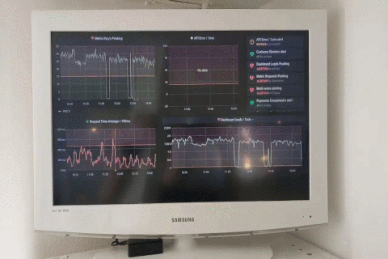

# infopi: Ansible managed info screens


## What is infopi?
This project offers a free and Ansible managed alternative to proprietary info screens. The only component needed is a Raspberry Pi.
The project should work with all Raspberry Pi's but is currently only tested on model 3.

It is recommended to run the rpi's on a seperated network or VLAN as rpi's left unsupervised are prone to external keyboard attacks.

[Blog post on Semaphor's website](https://blog.semaphor.dk/semaphor/blog.nsf/entries/20210309T1229)

### Demo



## Installation and configuration

### Preparing the project

To get started, clone this repository and generate an ssh keypair without password:

```bash
git clone https://github.com/semaphor-dk/infopi
ssh-keygen
```

After obtaining the repository, some configurations must be made in order to suit your infrastructure.

- Update `hosts` with the internal ip's or domains that point to the infopi's
- Point to the private ssh key in `ansible.cfg`
- Update url's to be cycled thorough through in the `group_vars/infopi.yml`
- Set amount of seconds between each tab switch in `roles/infopi/defaults/main.yml`


### Preparing the Raspberry Pi

Download and flash [Raspberry Pi OS Lite](https://www.raspberrypi.org/software/operating-systems/) to a micro SD card. This can be done with [Etcher](https://www.balena.io/etcher/)

When the card is flashed, boot the rpi and update/upgrade the OS. This can be done directly on the RPi or through ssh.

```bash
sudo apt update -y && sudo apt upgrade -y
```

With the built in `raspi-config` menu, enable auto login, ssh-server, and change the default password.
```bash
sudo raspi-config
```

The settings can be found under:

- 1 System Options
    - S3 Password
    - S5 Boot / Auto login
        - B2 Console Autologin
- 3 Interface Option
    - P2 SSH


If changing the resolution is necessary or a black border is present, it can be configured under `2 Display`

- 2 Display
    - D1 Resolution
    - D2 Underscan


Next, set a static ip, the gateway and DNS if it's required in `/etc/dhcpcd.conf`

```
interface eth0
static ip_address=192.168.1.2/24
static routers=192.168.1.1
static domain_name_servers=192.168.1.3
```

Put the public ssh key generated under the preparation in `~/.ssh/authorized_keys`

Disable password authentication and enable public key authentication by uncommenting the following in `/etc/ssh/sshd_config`

```
PubkeyAuthentication yes
PasswordAuthentication no
```

Allow the default user pi to run commands with sudo without prompting for password.

```bash
echo "%pi ALL=(ALL) NOPASSWD: ALL" | sudo tee -a /etc/sudoers
```

Make sure all unpacked packages are configured in dpkg with:
```bash
sudo dpkg --configure -a
```

### Manage and run!

Make sure you have ansible installed:

```bash
sudo apt install ansible -y
```

The initialization, configuration and updates of the infopi's can be done with:
```bash
ansible-playbook infopi.yml
```

## TO DO
- Harden RPi's
    - [ ] disable usb ports

- Automate with Ansible
    - [ ] autoscaling og black margin conf
    - [ ] autologin, password change og ssh-server enable
    - [ ] configure dpkg
    - [ ] generate and insert ssh keys
    - [ ] enable public key auth and disable password auth
    - [ ] enable pi user to run sudo commands without password prompt
    - [ ] set ip, dns and gateway
